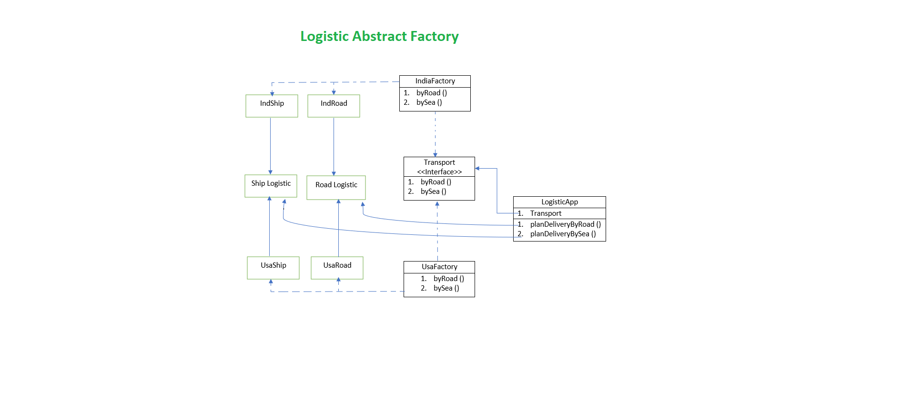

**The Abstract Factory Pattern**

The Abstract Factory Pattern provides an interface for creating families of related or dependent objects without specifying their concrete classes.

**Design Principle**

1. Abstract Factory relies on object composition: object creation is implemented in methods exposed in the factory interface.
2. The intent of Abstract Factory is to create families of related objects without having to depend 
on their concrete classes.
3. The Dependency Inversion Principle guides us to avoid dependencies on concrete types and to strive for abstractions.
4. Factories are a powerful technique for coding to abstractions, not concrete classes.

**Logistic Abstract App**

**Idle Steps:**

1.  When the App launch, it accept the prefered country.
2.  The application then create a factory object using the class that match the country.
3.  The rest of the application then behave as per country specific code.
4.  Here, we have to make RoadLogistic and ShipLogistic.
5.  The Specific country create the road and ship logistic as per native requirement.

