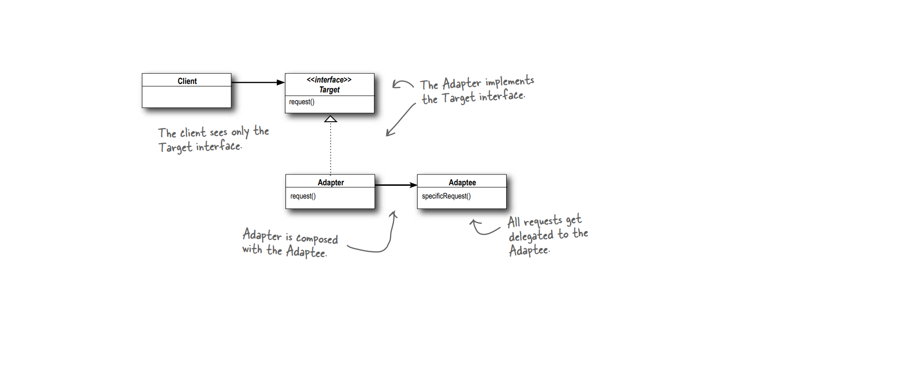

**Adapter Pattern**

The Adapter Pattern converts the interface of a class into another interface the clients expect. Adapter lets classes work together that couldn’t otherwise because of incompatible interfaces

**Design Principle**

1. When you need to use an existing class and its interface is not the one you need, use an 
adapter.
2. An adapter changes an interface into one a client expects.
3. Implementing an adapter may require little work or a great deal of work depending on the size 
and complexity of the target interface.

**Remote Control**

