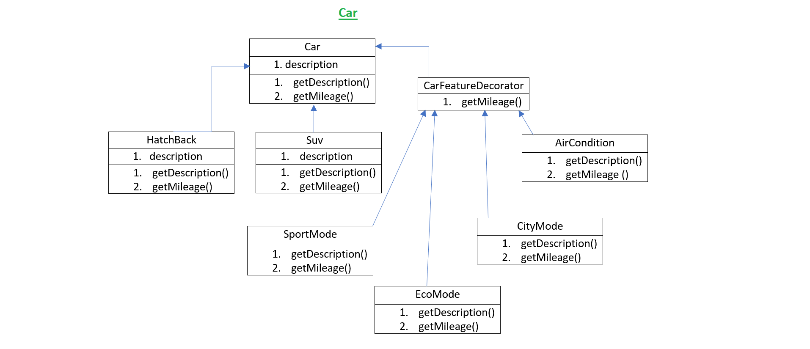

**Decorator Design Pattern**

The Decorator Pattern attaches additional responsibilities to an object dynamically. Decorators provide a flexible alternative to subclassing for extending functionality

**Design Principle**

1. The Decorator Pattern provides an alternative to subclassing for extending behavior.
2. The Decorator Pattern involves a set of decorator classes that are used to wrap concrete components.
3. Decorator classes mirror the type of the components they decorate. 
4. Decorators change the behavior of their components by adding new functionality before and/or after (or even in place of) method calls to the component.
5. Decorators can result in many small objects in our design, and overuse can be complex.

**Car**

**Idle Steps:**

1. Abstract class Car is the main class.
2. The HatchBack, Suv and CarFeature is the subclass of Car class.
3. The CarFeature is decorator class.
4. The Decorator class is inherited by other car features.
5. The Basic car like hatchback or suv mileage is affected by adding any driving mode or switch on AC.
6. The mileage of the car can be changes during run using the decorator class