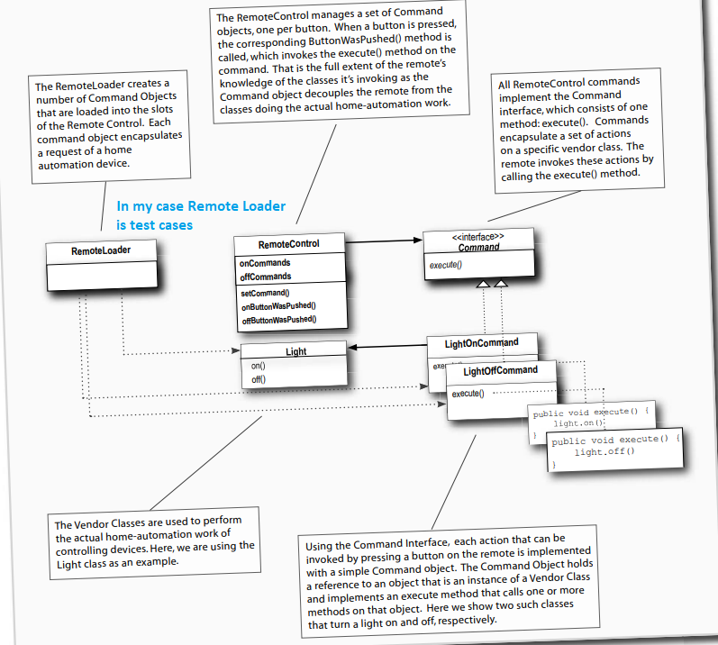

**Command Pattern**

The Command Pattern encapsulates a request as an object, thereby letting you parameterize other objects 
with different requests, queue or log requests, and support undoable operations.

**Design Principle**

1. The Command Pattern decouples an object, making a request from the one that knows how to perform it.
2. A Command object is at the center of this decoupling and encapsulates a receiver with an action (or set of actions).
3. An invoker makes a request of a Command object by calling its execute() method, which invokes those actions on the receiver.
4. Invokers can be parameterized with Commands, even dynamically at runtime.
5. Commands may support undo by implementing an undo method that restores the object to its previous state before the execute() method was last called.

**Remote Control**

