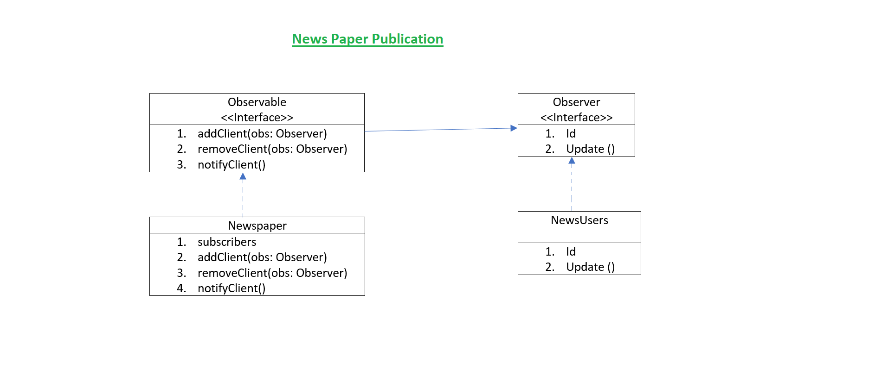

**Observer Design Pattern**

The Observer Pattern defines a one-to-many dependency between objects so that when one 
object changes state, all of its dependents are notified and updated automatically.

**Design Principle**

1. The subscription mechanism to notify multiple objects about any events that happen to the object they’re observing.
2.  An observable is an object which notifies observers about the changes in its state.
3.  An observer is an object that watches the state of an object(observable).
4.  The Observer Pattern provides an object design where subjects and observers are loosely coupled.

**New Paper Publication**

**Idle Steps:**

 1. A news user (observer) will subscribe to the newspaper.
 2. A registered (observer) user can unsubscribe from the newspaper.
 3. A newspaper will contain the list of subscribers (observers).
 4. Whenever the newspaper wants to update the info, the newspaper will invoke notification and the registered subscribers will be notified about the update.

