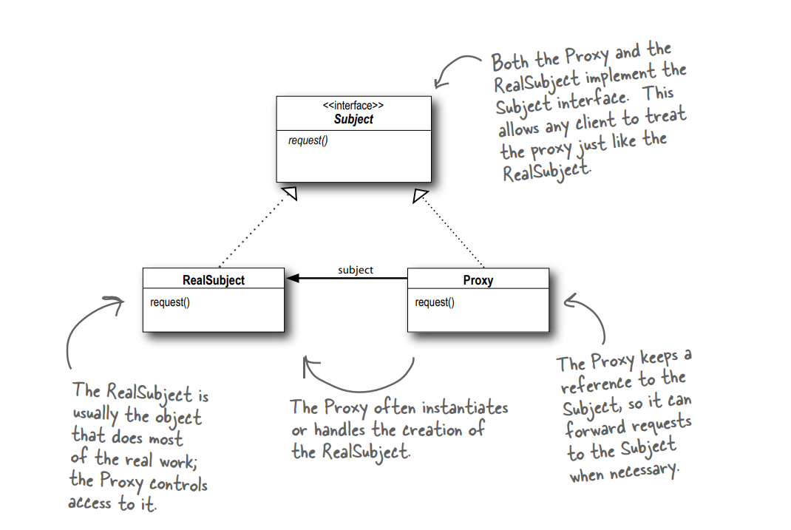

**Proxy Pattern**
The Proxy Pattern provides a surrogate or placeholder for another object to control access to it.

**Design Principle**

1. Use the Proxy Pattern to create a representative object that controls access to another object,    which may be remote, expensive to create or in need of securing.
2. A Remote Proxy manages interaction between a client and a remote object.
3. A Virtual Proxy controls access to an object that is expensive to instantiate.
4. A Protection Proxy controls access to the methods of an object based on the caller.
5. Implementing an adapter may require little work or a great deal of work depending on the size 
and complexity of the target interface.
6. Protection Proxy controls access to the methods of an object based on the caller.

