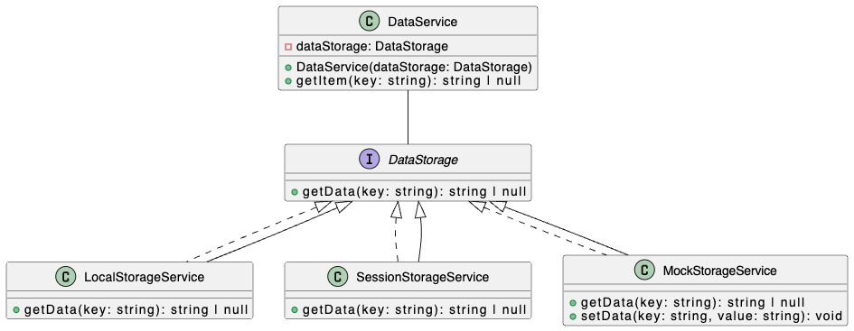

# Dependency Inversion Principle:

The Dependency Inversion Principle states:

1. High-level modules should not depend on low-level modules. Both should depend on interfaces or abstract classes (abstractions).
2. Interfaces or abstract classes (abstractions) should not depend on concrete implementations (details). Concrete implementations should depend on interfaces or abstract classes.

DIP is about system maintainability and reusability.

### Why `DataService` in `bad.ts` violates DIP.

The `DataService` is tightly coupled to the `LocalStorageService`. If we want to switch to a different data storage mechanism (e.g., a database, session storage, or a mock for testing), we have to modify the `DataService` class.

### Key Improvements:

* **Decoupling**: `DataService` is no longer dependent on a specific data storage implementation.
* **Flexibility**: We can easily switch data storage mechanisms by injecting a different implementation of the `DataStorage` interface.
* **Testability**: We can easily mock the `DataStorage` interface for unit testing the `DataService`.
* **Maintainability**: Changes to one data storage implementation do not affect the `DataService`.