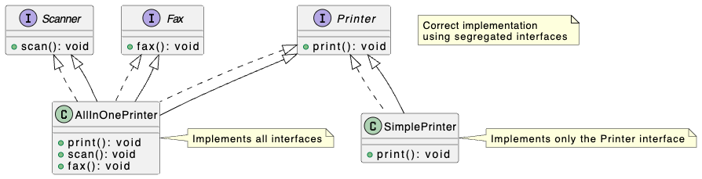

# Interface Segregation Principle

The Interface Segregation Principle (ISP) states that clients should not be forced to depend on methods they do not use. In other words, large interfaces should be split into smaller, more specific interfaces so that clients only need to know about the methods that are relevant to them.

ISP is about preventing inadvertent coupling between a client code and some behaviors it won’t need.

### Why `SimplePrinter` in `bad.ts` violates ISP.

The `SimplePrinter` class is forced to implement the `scan()` and `fax()` methods, even though it doesn't support those functionalities. This violates the ISP because the `SimplePrinter` is depending on methods it doesn't use. This can lead to unnecessary complexity and potential runtime errors (as seen in the example with the `Error` throws).

### Key Improvements:

* **Decoupling**: Clients are no longer forced to depend on methods `print`, `scan`, and `fax` they don't use.
* **Flexibility**: It's easier to create new classes (`AllInOnePrinter` and `SimplePrinter`) that implement only the necessary interfaces.
* **Maintainability**: Changes to one interface are less likely to affect other parts of the system.
* **Testability**: Smaller interfaces are easier to mock and test in isolation.
