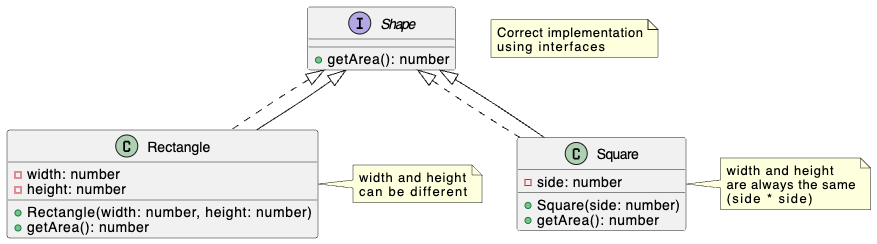

# Liskov Substitution Principle

The Liskov Substitution Principle (LSP) states that Objects of a superclass should be able to be replaced with objects of a subclass without affecting the correctness of the program."

You should be able to substitute one thing for another if those things are declared to behave the same way.

 

### Why `bad.ts` violates LSP.

The `increaseRectangleWidth` function is designed to work with `Rectangle` objects. It assumes that setting the width of a rectangle only changes the width. However, when we pass a `Square` object to this function, setting the width also changes the height, leading to an unexpected result. The `Square` doesn't behave as a drop-in replacement for `Rectangle` in this context.

### Key Improvements:

* LSP is about substitutability. Subtypes should be usable wherever their base types are used without unexpected behavior.
* Violating LSP can lead to subtle bugs and make code harder to maintain and reason about.
* Often, composition or separate interfaces are better choices than inheritance when modeling relationships like "square is a rectangle" if the subtype has different constraints or behaviors.
* Focus on behavior, not just data structure. Just because a square has the same data members as a rectangle (width and height) does not mean it should inherit from it.