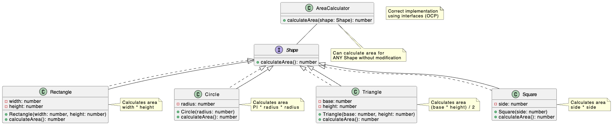

https://stackoverflow.blog/2021/11/01/why-solid-principles-are-still-the-foundation-for-modern-software-architecture/

# Open/Closed Principle

The Open/Closed Principle (OCP) states that software entities (classes, modules, functions, etc.) should be open for extension but closed for modification. This means you should be able to add new functionality without changing existing code. 

Software entities should be open for extension, but closed for modification.

 

### Why `bad.ts` violates OCP.

If we want to add a new shape (e.g., a square or a triangle), we have to modify the `calculateArea` method, which can introduce bugs and requires retesting the existing code.

### Key Improvements:

* **Extensibility**: We can easily add new shapes without modifying the AreaCalculator.
* **Maintainability**: Changes to one shape class do not affect other parts of the system.
* **Testability**: Each shape class can be tested independently.