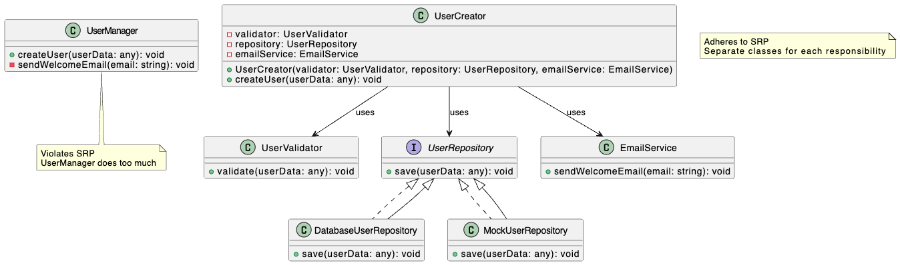

# Single Responsibility Principle 

The Single Responsibility Principle (SRP) dictates that a class should have only one reason to change, meaning it should have only one specific job or responsibility. This focus ensures that a class performs a single, well-defined task.

SRP is about logic partitioning into code: which logic should be declared in which class. 

### Why `UserManager` in `bad.ts` violates SRP:

The `UserManager` class has three distinct responsibilities:

1. User data validation.
2. Saving the user to the database.
3. Sending a welcome email.

So, three possible reasons to change. For example, if the email-sending logic changes (e.g., if we want to use a different email service or change the email template), we have to modify the `UserManager` class, even if the user-creation or validation logic remains the same. This violates the SRP.

### Key Improvements:

* **Separation of Concerns**: Each class now has a single, well-defined responsibility:
  * `UserValidator`: Validates user data.
  * `UserRepository`: Handles data persistence (saving to the database or other storage).
  * `EmailService`: Sends emails.
  * `UserCreator`: Orchestrates the user creation process by using all other services.

* **Increased Flexibility**: If we need to change how users are validated, saved, or emailed, we only need to modify the corresponding class.

* **Improved Testability**: Each class can be easily unit tested in isolation. We can mock the dependencies of the UserCreator to test its logic without relying on a real database or email service.

* **More Reusable Code**: The individual classes can be reused in other parts of the application.