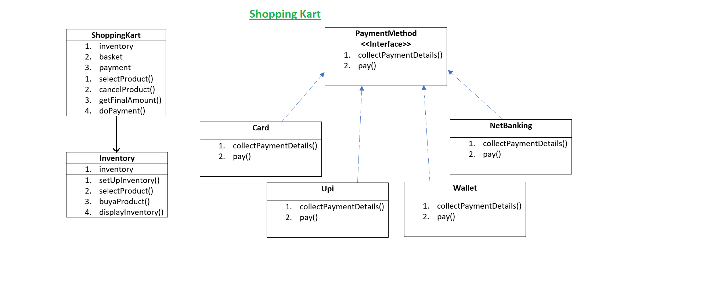

**Strategy Design Pattern**

The Strategy Pattern defines a family of algorithms, encapsulates each one, and makes them interchangeable. Strategy lets the algorithm vary independently from clients that use it.

**Design Principle**

1. Identify the aspects of your application that vary and separate them from what stays the same.

2. Program to an interface, not an implementation.
   
3. Favor composition over inheritance. It let you encapsulate a family of algorithms into their own set of classes, but it also lets you change behavior at runtime as long as the object you’re composing with implements the correct behavior interface.

**Shopping Kart**

**Idle Steps:**

 1. User will add the Products from Shopping Kart to the basket.
 2. Then Two way of doing payment provided
    1. Random payment: user will click payment, and randmonly one payment will completed.
    2. User choice: User willl pick payment as per his choice
 3. After Payment the Basket will be empty and inventory will be updated

